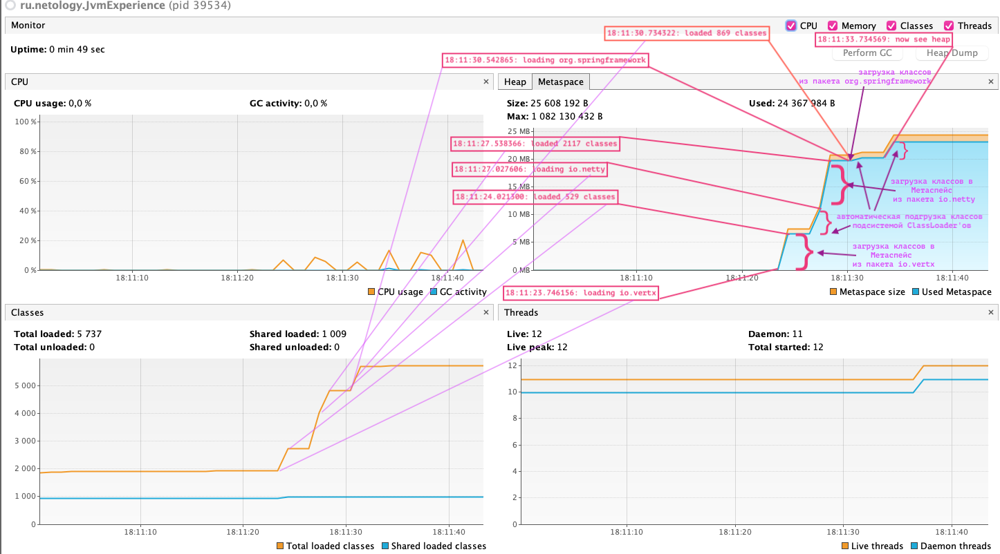
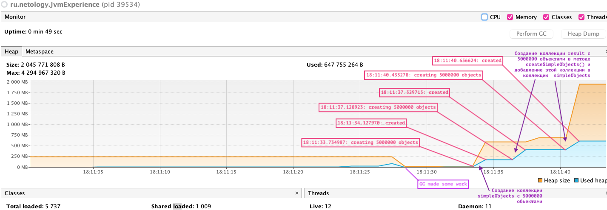

# Задача 2 "Исследование JVM через VisualVM"

## *Цель:*
Изучение использования памяти через VisualVM при загрузке новых классов и создании новых объектов

## *Решение:*
### *1) Описание событий в памяти Metaspace:*

### *2) Описание событий в памяти Heap:*

